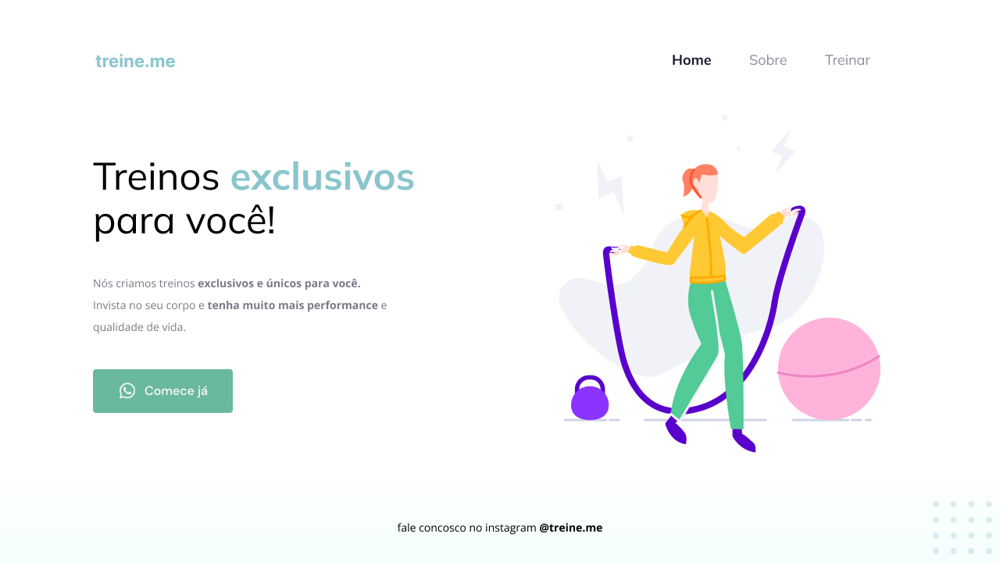

<h1 align="center"> Projeto 02</h1>

  <a href="#-tecnologias">Tecnologias</a>&nbsp;&nbsp;&nbsp;|&nbsp;&nbsp;&nbsp;
  <a href="#-projeto">Projeto</a>&nbsp;&nbsp;&nbsp;|&nbsp;&nbsp;&nbsp;
  <a href="#-layout">Layout</a>

 

  

## 🚀 Tecnologias

Esse projeto foi desenvolvido com as seguintes tecnologias:

- HTML e CSS
- Figma

## 💻 Projeto

O Projeto 02 é um projeto da trilha Explorer da Rocketseat, o projeto é desenvolvido no "Stage 02 - Introdução ao HTML e CSS".

- [Acesse o projeto finalizado, online](https://lybiomoraesjr.github.io/RocketseatExplorer_HTML_CSS_Project02/)

## 🔖 Layout

Você pode visualizar o layout do projeto através [DESSE LINK](https://www.figma.com/file/fAvYZz4dPV5MfhL77XkqkD/Explorer---Projeto-01/duplicate). É necessário ter conta no [Figma](https://figma.com) para acessá-lo.

---

Feito com ♥ by Lybio Moraes Junior

